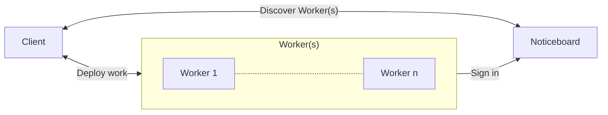
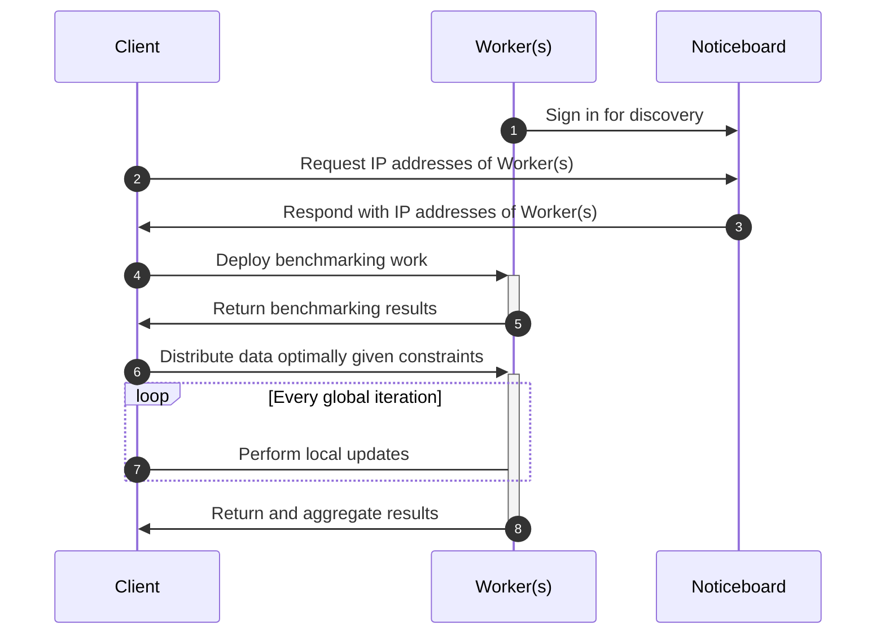

# Architecture

This document describes the high-level architecture of the experimental set up. If you want to familiarize yourself with the code base, you are just in the right place!

## Bird's Eye View

Here is a flowchart diagram of the network:

Here's a sequence diagram of the events that occur during a typical experiment:

On the highest level, this project uses the [axon-ecrg](https://github.com/DuncanMays/axon-ECRG#readme) edge computing framework to create a proof of concept system for parallelising work through distributed computing, which aims to optimize the amount of data sent to each worker to minimize he overall cost incurred by the job deployer,

## Code Map

This section talks briefly about various important directories/files.

### `src`

Source code for files used in the experimental set up.

### `src/notice_board.py`

A server that workers sign in to for discovery by clients. For more information, refer to [axon-ecrg's README](https://github.com/DuncanMays/axon-ECRG#how-do-i-find-workers-on-my-network).

### `src/worker.py`

A server that signs in to a noticeboard for discovery by clients. It can receive units of work from a client to compute, and then return the results to client.

This worker has been modified to have wages set for it, which means they won't work on something that won't pay above their minimum wage.

### `src/client.py`

A server that requests workers from a noticeboard. A client can deploy work to workers to compute in parallel.

### `src/data_assignment`

Contains the data assignment algorithm the client uses to assign data to workers to optimize for cost while meeting certain constraints.

### `src/tests`

Integration and unit tests.

### `data`

Contains Jupyter notebooks which test for the optimality of the experimental setup and generates figures.
