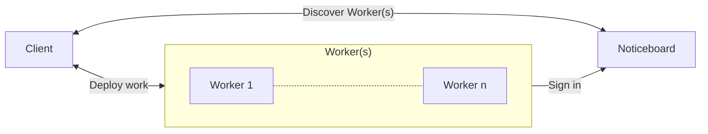
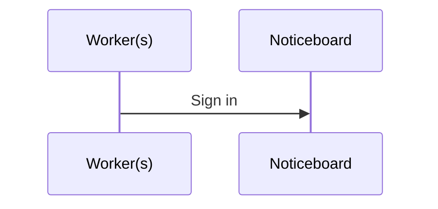

# Architecture

This document describes the high-level architecture of the experimental set up. If you want to familiarize yourself with the code base, you are just in the right place!

## Bird's Eye View

Here's a flowchart diagrams of the network:

Here's a sequence diagram of the events that occur while training on the network:

On the highest level, this project uses [axon-ecrg](https://github.com/DuncanMays/axon-ECRG#readme) to create a proof of concept framework for parallelizing work through distributed computing which optimizes the amount of data sent to each worker.

## Code Map

This section talks briefly about various important directories/files.
